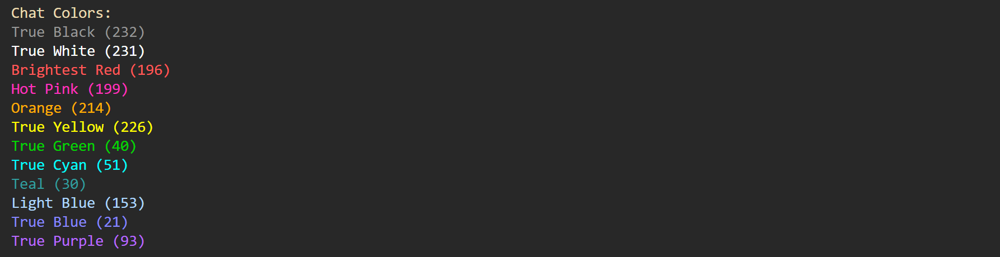

# Server Client Chat Room

Have you maybe, just maybe, ever want to use a chatroom with your friends? ~~Well why not use Discord?~~ Well why not use this server-client chat room! It's just a basic server and client chat room that connects clients to the server. Here's a demo:

https://github.com/user-attachments/assets/5f02a561-2a1e-4ba5-a0cb-04597fac033b

It offers the most basic of basic chat room experience. Nothing but straight back and forth chatting with, get this, a choice of color for your messages. (Woah so revolutionary).

_Sorry if the audio is a little quiet (╥ᆺ╥；)_

## Set Up and Installing

There is one dependency that this script uses and thats `Loguru`. Don't worry it won't give you a virus or anything, it's just a newer generation logging module. Make sure to install it using the appropriate method. The most common is using: `pip install loguru`

Ok to actually get started you'll want to clone either this whole directory, or `chat_server` or `chat_client` using whatever method you want to use. From there follow the steps below for server or client set up.

### Setting up the server

To set up the server all you have to do it run one basic command: `python3 chat_server.py` This will get the server up and listening. All you have to do is wait for a client to connect.

### Setting up the client

To get a client up and running it's also just as simple as typing this command: `python3 chat_client.py` This will connect you to the server, which has to be up first by the way. From there it will ask you for your username and a color choice from a lovely list of colors. There's also some client side commands:
    
1) `/join <room name>` This is used to join an existing private room or make one for yourself.
2) `/leave` This is used to leave the private room and go back to the public chat.
3) `/exit` This is used to leave the server (disconnect it). You can use it from anywhere!
4) `/list` This is used to list all of the rooms that are opened in the sever. It will also list the number of people in each room.

## Features

Theres a billion cool features that I put in. Well maybe not a billion but a few!

- __Name Coloring.__ Who doesn't like a little bit of color. Aside from making the chat room a little more colorful and engaging, it helps you differntiate your messages from others in the room! The avalible colors are as follows: `black, white, pink, red, orange, yellow, green, cyan, teal, light blue, blue, purple.` There's a color chart located in `color.py` as a reference and below. Take advantage of the beauty of ANSI Codes and make the chat a little more fun!

    

- __Custom Usernames.__ Along with epic message coloring there's also the option to pick your username upon joining the server. Isn't that just so neat?

- __Private Rooms.__ Because this is a ~~Discord knock off~~ a really cool chat room, there's an option to create and join private rooms! Like DMs where anyone can join at any time, because thats how not so private rooms work.

## Logging

Like I mentioned, this script is dependent on `Loguru` for it's logging. Most of the logging happens on the server side of things, but both client and server scripts have logging that will log to a text file. And since I'm super amazing the text file will __cap at 500 KB and will delete every week.__