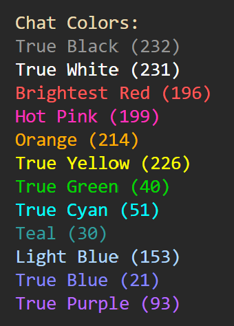

! Make sure to add a video !

# Server Client Chat Room

Have you maybe, just maybe, ever want to use a chatroom with your friends? ~~Well why not use Discord?~~ Well why not use this server-client chat room! It's just a basic server and client chat room that connects clients to the server. 

It offers the most basic of basic chat room experience. Nothing but straight back and forth chatting with, get this, a choice of color for your messages. (Woah so revolutionary).

## Set Up and Installing

There is one dependency that this script uses and thats `Loguru`. Don't worry it won't give you a virus or anything, it's just a newer generation logging module. Make sure to install it using the appropriate method. The most common is using: `pip install loguru`

Ok to actually get started you'll want to clone either this whole directory, or `chat_server` or `chat_client` using whatever method you want to use. From there follow the steps below for server or client set up.

### Setting up the server

To set up the server all you have to do it run one basic command: `python3 chat_server.py` This will get the server up and listening. All you have to do is wait for a client to connect.

### Setting up the client

To get a client up and running it's also just as simple as typing this command: `python3 chat_client.py` This will connect you to the server, which has to be up first by the way. From there it will ask you for your username and a color choice from a lovely list of colors.

## Features

Theres a billion cool features that I put in. Well maybe not a billion but a few!

- __Name Coloring.__ Who doesn't like a little bit of color. Aside from making the chat room a little more colorful and engaging, it helps you differntiate your messages from others in the room! The avalible colors are as follows: `black, white, pink, red, orange, yellow, green, cyan, teal, light blue, blue, purple.` There's a color chart below for reference:
        